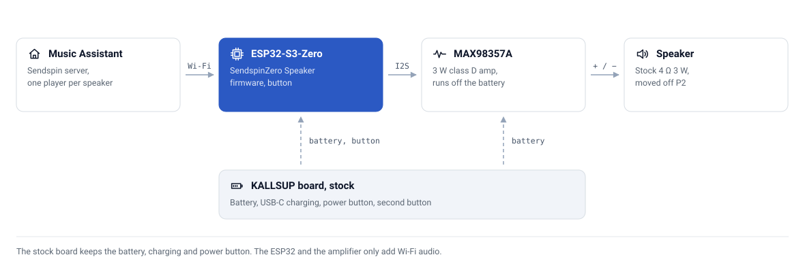

<div align="center">


# 🔊 KALLSUP Sendspin for Music Assistant

**An IKEA KALLSUP Bluetooth speaker turned into a battery-powered Music Assistant Wi-Fi speaker, with its case, speaker, battery, charging and buttons kept.**


[](https://github.com/CaputoDavide93/Kallsup-Sendspin-MusicAssistant/actions/workflows/ci.yml)

</div>

---

The KALLSUP (model E2507) is a small IKEA speaker with a 750 mAh battery, a USB-C charger, one 4 Ω 3 W driver and no audio input other than Bluetooth. This build adds an ESP32-S3-Zero running [SendspinZero](https://github.com/RealDeco/SendspinZero)'s speaker firmware and an Adafruit MAX98357A amplifier. Music Assistant streams to it over [Sendspin](https://www.sendspin-audio.com); the stock board keeps holding the battery, charging it and, through its switched battery rail 🔍, switching the speaker on and off.

Bluetooth is given up on purpose. Keeping it means feeding audio into the stock amplifier's input, which needs a small 0603 solder joint and more reverse engineering; that route is written up in [Alternatives](docs/alternatives.md) for anyone who wants it.

> **Project status.** The firmware is validated by CI and the wiring is designed from continuity measurements on a real board. The complete build has not yet been run end to end. Three things are still to be measured on the board before soldering, and every doc marks them with 🔍: where the switched battery rail is, how the second button's pad behaves, and whether the speaker switches itself off on battery. See [Build guide](docs/build-guide.md#before-you-solder).

---

## ✨ What's in here

| | Component | What it does |
|---|---|---|
| 📟 | **Firmware** (`firmware/`) | ESPHome config: SendspinZero Speaker as a pinned remote package, plus an encrypted API, OTA locked to the same key, Wi-Fi and a fallback-hotspot password from secrets, and the KALLSUP's second button as play/pause, next and previous |
| 🔌 | **Wiring** (`docs/wiring.md`) | Every connection, pad by pad, with the reason for each |
| 🔬 | **Board notes** (`docs/board-notes.md`) | What is on the KALLSUP board: the JL7016C8 Bluetooth SoC, the ANT8817S amplifier and a summary of its datasheet, test pads, the continuity test log, and which findings are measured versus inferred |
| 🧭 | **Build guide** (`docs/build-guide.md`) | Bench test, the three multimeter checks, then soldering, first power-up, battery runs and assembly |

---

## 🗺️ Architecture

<picture>
  <source media="(prefers-color-scheme: dark)" srcset="docs/assets/architecture-dark.svg">
  
</picture>

The ESP32 and the amplifier take power from the stock board's switched battery rail 🔍 (check 1 in the build guide finds it), so the original power button turns the whole speaker, Wi-Fi included, on and off, and the original USB-C port still charges it. The stock Bluetooth chip and amplifier stay on the board and stay powered; they simply have no speaker connected any more.

Deeper: [Wiring](docs/wiring.md) · [Board notes](docs/board-notes.md).

---

## 🧰 Parts

| | Part | Why | Approx. cost |
|---|---|---|---|
| 🧠 | [Waveshare ESP32-S3-Zero](https://www.waveshare.com/wiki/ESP32-S3-Zero) | The 2 MB of PSRAM is what makes Sendspin fit | £6 |
| 🔈 | [Adafruit MAX98357A](https://www.adafruit.com/product/3006) | I2S in, speaker out; runs straight off a Li-ion cell | £6 |
| ⚡ | TPS63020 3.3 V buck-boost module, *optional* | Keeps the ESP32 stable below about 3.7 V of battery | £4–9 |
| 🧵 | Thin silicone wire, heat-shrink, Kapton tape | Wiring and insulation inside the case | — |

The ESP32's own regulator accepts 3.7–6 V on its 5V pin, so on a full battery it runs without the TPS63020. Add the module if it resets as the battery drains. An LM2596 or other step-down-only module does not work here: it needs its input well above its output, and a Li-ion cell never is. More in [Hardware](docs/hardware.md).

---

## 🔌 Wiring

<picture>
  <source media="(prefers-color-scheme: dark)" srcset="docs/assets/wiring-dark.svg">
  
</picture>

| From | To | Note |
|---|---|---|
| 🔍 Switched battery pad | MAX98357A `Vin` | Accepts 2.5–5.5 V, so no regulator |
| 🔍 Switched battery pad | ESP32 `5V`, **or** TPS63020 `VIN` → `OUT` → ESP32 `3V3` | Never feed both `5V` and `3V3` |
| `GND1` | Every `GND` | One ground point |
| 🔍 Second-button pad | ESP32 `GPIO1` | After measuring it |
| ESP32 `GPIO2` / `GPIO3` / `GPIO4` | MAX98357A `DIN` / `BCLK` / `LRC` | Pins set by the SendspinZero Speaker firmware |
| MAX98357A `+` / `−` | Speaker red / black | Unplugged from the stock `P2` |

On the KALLSUP board that is three joints: `GND1` and the button pad are large test pads, and the switched battery point is wherever check 1 finds it 🔍, possibly the end of a passive part. Nothing touches the amplifier chip. Full detail, photos and the reasons: [Wiring](docs/wiring.md).

---

## 🚀 Quick Start

1. **Bench test first.** Wire the ESP32 and the MAX98357A on the desk, flash the firmware, and play something from Music Assistant through any small speaker. See [Firmware](docs/firmware.md).
2. **Measure the board.** Three multimeter checks, no soldering; the auto-off check needs the speaker left on for at least 30 minutes: [Before you solder](docs/build-guide.md#before-you-solder).
3. **Wire it in.** Three joints on the KALLSUP board, then the speaker onto the amplifier: [Build guide](docs/build-guide.md).

Flashing, from a clone of this repository:

```bash
cp firmware/secrets.yaml.example firmware/secrets.yaml   # Wi-Fi, hotspot password, API key
pip install esphome
esphome run firmware/kallsup-sendspin.yaml
```

For the very first flash, hold the ESP32's **BOOT** button while plugging in the USB-C cable. After that, updates go over the air. Home Assistant discovers the speaker as an ESPHome device and asks for the `api_encryption_key`; Music Assistant then offers it as a Sendspin player.

---

## ⚙️ Configuration

The second button, from [`firmware/kallsup-sendspin.yaml`](firmware/kallsup-sendspin.yaml):

| Press | Action |
|---|---|
| Single | Play / pause |
| Double | Next track |
| Triple | Previous track |

The power button is not wired to the ESP32. It stays with the stock board and switches everything through the switched battery rail 🔍.

Entities the speaker exposes to Home Assistant: **Sendspin Group Media Player**, **Media Player**, **Song Title**, **Song Artist**, **Album Name**, **Startup sound**, **Restart**, **LED light** (all from SendspinZero), and **Button** (this repository). The on-board LED is red when idle and green while playing.

Loudness: the MAX98357A's `GAIN` pin is left open. SendspinZero documents `GAIN` to `GND` for 12 dB, or through 100 kΩ to `GND` for 15 dB. Everything else is in [Firmware](docs/firmware.md).

---

## 📖 What's on the KALLSUP board

| | Part | Finding |
|---|---|---|
| 📡 | **U2, JL7016C8** | JieLi Bluetooth audio SoC, 24 MHz crystal |
| 🔈 | **U1, ANT8817S** | Anatek mono Class H amplifier with built-in boost: 3.5 W into 4 Ω at 3.7 V and 1% THD, differential input, a CTRL pin for mode and anti-clipping. Pin 1 is bottom-left with the marking upright (🔎 from the photo); `VCC_PVDD` is pin 7 |
| 🔊 | **Speaker output** | Bridge-tied (🔎 from the layout): treat `Speaker -` as **not** ground. Never tie it to ground or to another amplifier |
| 🔋 | **Power** | 3.6 V 750 mAh cell on `P1`, USB-C 5 V 1 A, test pads `VCC_BAT`, `VCC_5V`, `VCC_PVDD`, `IOVDD`, `GND1` |

Every finding, with how it was established and what is still open: [Board notes](docs/board-notes.md).

---

## 📁 Repo structure

```text
Kallsup-Sendspin-MusicAssistant/
├── firmware/
│   ├── kallsup-sendspin.yaml   # 📟 ESPHome config: SendspinZero Speaker + KALLSUP button
│   └── secrets.yaml.example
├── docs/                       # 📚 build guide, wiring, board notes (index: docs/README.md)
│   └── assets/                 # 🖼️ light/dark diagrams, teardown photos, annotated copies
├── brand/                      # 🎨 icon, drawn by tools/gen_brand.py
├── tools/
│   ├── gen_diagram.py          # 🤖 draws docs/assets diagrams; --check in CI
│   ├── annotate_photos.py      # 🏷️ rings and labels on copies of the photos
│   └── gen_brand.py            #    draws brand/icon.png
├── .github/
│   ├── workflows/ci.yml        # ✅ ESPHome config validates, diagrams up to date
│   ├── ISSUE_TEMPLATE/         # 🐛 bug report, feature request
│   └── dependabot.yml
├── .gitignore                  # 🙈 secrets.yaml, .esphome/, editor files
├── AGENTS.md                   # 🤖 agent rules for this repo
├── CHANGELOG.md
├── CLAUDE.md
├── CONTRIBUTING.md
├── LICENSE
├── README.md
└── SECURITY.md
```

---

## 🧪 Testing

```bash
cp firmware/secrets.yaml.example firmware/secrets.yaml
sed -i.bak "s|CHANGE_ME_KEY|$(openssl rand -base64 32)|" firmware/secrets.yaml && rm firmware/secrets.yaml.bak
esphome config firmware/kallsup-sendspin.yaml   # validates, including the remote package
python3 tools/gen_diagram.py --check            # diagrams match the generator
```

CI runs both on pushes to `main`, on pull requests and weekly. They prove the config is valid and the diagrams are current; they cannot prove the wiring, which is why the build guide starts with a bench test.

---

## 🛠️ Troubleshooting

The two most likely: the ESP32 resetting as the battery runs down (add the TPS63020), and the speaker switching itself off on battery 🔍, if the stock board has an idle timer (check 2). Both, and the rest, in [Troubleshooting](docs/troubleshooting.md).

---

## 🔒 Security

The speaker joins your Wi-Fi and exposes the ESPHome API. This repository encrypts the API, makes over-the-air updates require the same key, and puts a password on the fallback hotspot; the SendspinZero config on its own leaves all three open. While the hotspot is up, its captive portal accepts a firmware upload without the key, so choose a strong `fallback_password`. Read [SECURITY.md](SECURITY.md).

---

## 🙏 Credits

The audio firmware is [SendspinZero](https://github.com/RealDeco/SendspinZero) by RealDeco (MIT), used unmodified as a pinned package. [Sendspin](https://www.sendspin-audio.com) and [Music Assistant](https://www.music-assistant.io) do the streaming.

---

## 🤝 Contributing

See [CONTRIBUTING.md](CONTRIBUTING.md). Measurements from other KALLSUP units are the most useful contribution, especially the three 🔍 items.

---

## 📄 License

MIT. See [LICENSE](LICENSE). Changes are recorded in [CHANGELOG.md](CHANGELOG.md).

---

<p align="center"><sub>Made with ❤️ by <a href="https://github.com/CaputoDavide93">Davide Caputo</a></sub></p>
