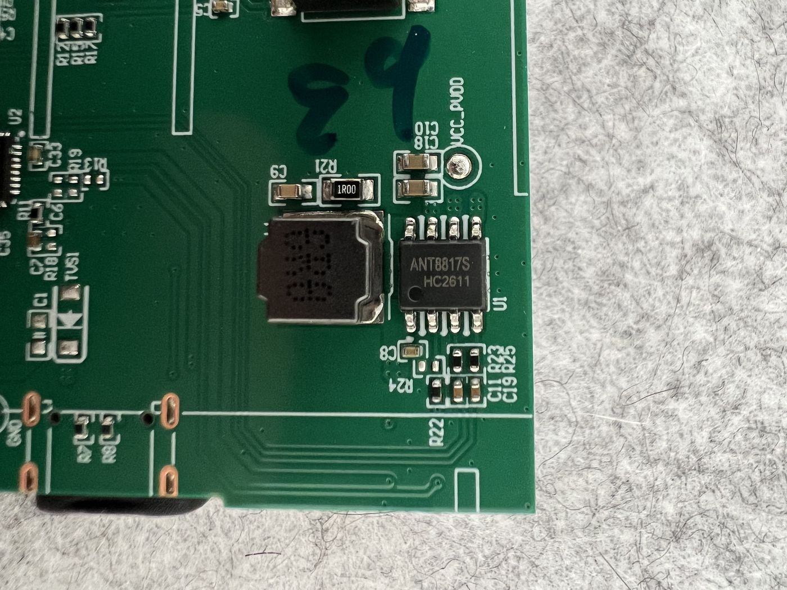
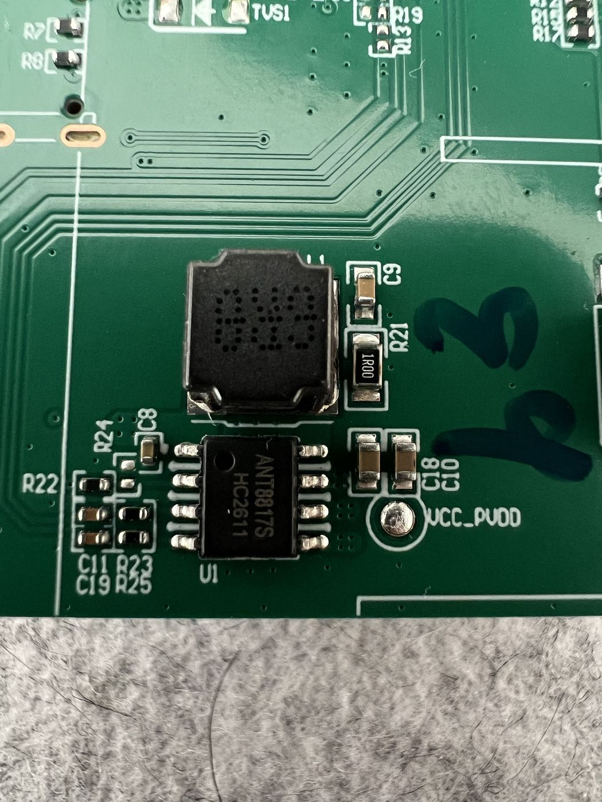
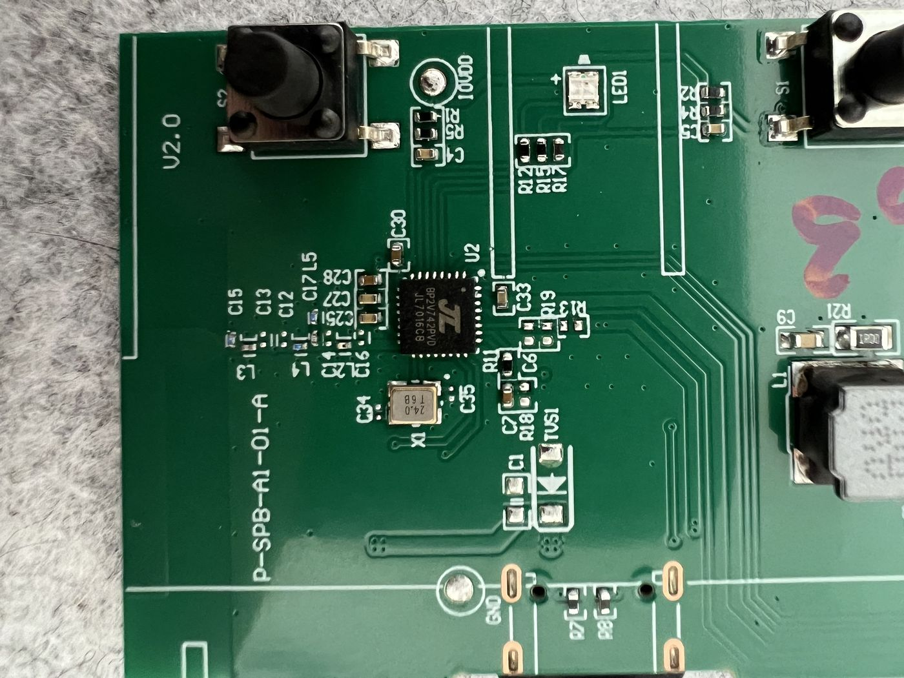
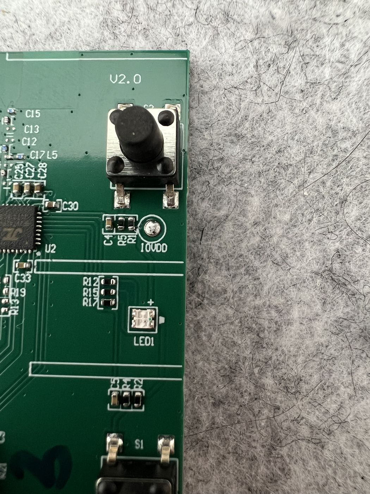
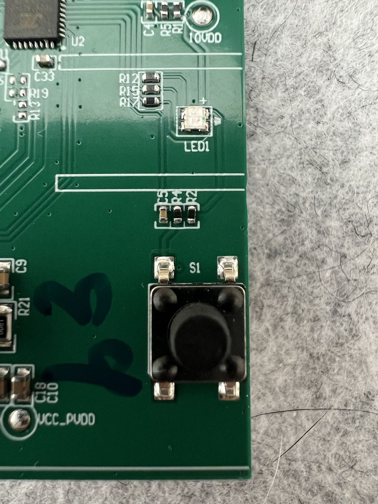
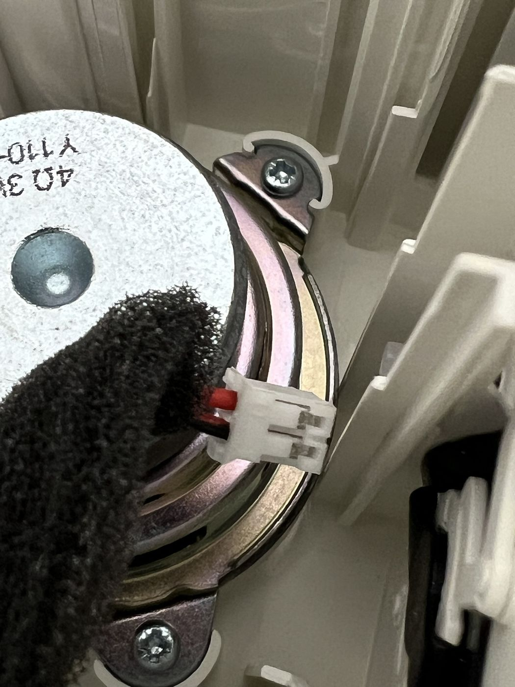

# 🔬 KALLSUP board notes

What is on the KALLSUP E2507's board, from one teardown. Each finding is marked:

- ✅ **Measured**: continuity or a reading on this board.
- 🔎 **Inferred**: from markings, layout or the datasheet, not measured.
- 🔍 **Open**: not known yet.

The build in this repository only relies on ✅ findings and the three 🔍 checks in the [Build guide](build-guide.md#before-you-solder). The amplifier details matter only for the Bluetooth-keeping routes in [Alternatives](alternatives.md).

## Identification

| | Finding | Status |
|---|---|---|
| 📦 | IKEA KALLSUP, model E2507 | ✅ |
| 🔋 | Li-ion cell, 3.6 V 750 mAh, on 3-pin connector `P1` (battery, NTC, ground) | ✅ label; 🔎 pin order |
| 🔌 | USB-C input, 5 V 1 A | ✅ label |
| 🔊 | Driver marked 4 Ω 3 W, red and black leads, on 2-pin connector `P2` | ✅ |
| 🟩 | PCB marked `P-SPB-A1-01-A` and `V2.0` on the front, `E324220 JS` on the back | ✅ |
| 🎧 | No 3.5 mm input | ✅ |

## Main parts

| Ref | Part | Notes | Status |
|---|---|---|---|
| U2 | JieLi **JL7016C8** (second marking line `BP2V742PVD`) | Bluetooth audio SoC, 24 MHz crystal `X1` | ✅ marking |
| U1 | Anatek **ANT8817S** (second marking line `HC2611`) | Mono Class H amplifier with built-in boost, eSOP8 | ✅ marking |
| L1 | Shielded power inductor next to U1 | The amplifier's boost inductor | 🔎 |
| R21 | 1 Ω (`1R00`) with C9 | Probably the amplifier's supply filter | 🔎 |
| EC1, EC2 | 470 µF 10 V electrolytics | Bulk capacitance, likely on the boosted rail | 🔎 |
| D1 | SS34 Schottky, 3 A 40 V | Power path from USB | 🔎 |
| Q1 | `2301D`, a P-channel MOSFET | Power switching | 🔎 |
| R7, R8 | Next to the USB-C port | Probably the USB-C CC resistors | 🔎 |
| LED1 | Two-colour LED | Status | ✅ |
| S1, S2 | Tactile buttons, each with a test pad on the back | Which is power is 🔍 | ✅ |

## Test pads

| Pad | Side | What it is | Status |
|---|---|---|---|
| `GND1` | Back | Ground; beeps to the USB-C shell | ✅ |
| `VCC_5V` | Back | USB 5 V | 🔎 |
| `USB_DP1`, `USB_DM1` | Back | USB data | 🔎 |
| `VCC_BAT` | Back | Cell | 🔎 |
| `BAT_NTC` | Back | Battery thermistor | 🔎 |
| `Speaker +1`, `Speaker -1` | Back | Amplifier output, beep to the upper and lower `P2` contacts | ✅ |
| `S1`, `S2` | Back | The two buttons | ✅ labels; behaviour 🔍 |
| `VCC_PVDD` | Front | Beeps to U1 pin 7; the output-stage supply | ✅ continuity; 🔎 role |
| `IOVDD` | Front | JL7016C8 I/O supply | 🔎 |
| `GND` | Front | Ground, by the USB-C port | 🔎 |

## The ANT8817S

The datasheet is only published in Chinese. The facts below are from the manufacturer's manual (ANT8817 product manual V1.0.3, posted on the [21ic forum](https://bbs.21ic.com/icview-3050260-1-1.html)) and from distributor listings that reproduce it ([dzsc](https://product.dzsc.com/product/785710-202112214757633.html)).

| | Datasheet fact |
|---|---|
| 🔊 | 3.5 W into 4 Ω at 3.7 V and 1% THD, mono |
| ⚡ | Synchronous adaptive boost with several supply rails (Class H), up to 80% overall efficiency |
| 🎚️ | ALC: detects clipping and lowers the gain, so a loud track or a sagging battery does not distort |
| 🔀 | `CTRL` pin: its voltage selects the operating mode and turns ALC on or off |
| 🎛️ | Fully differential input |
| 🔋 | 3–5 V single supply |
| 🛡️ | Over-current, over-temperature and short-circuit protection; pop suppression at power-up and power-down |
| 📦 | eSOP8, with an exposed pad underneath |

A distributor lists it as a replacement for the ANT8815S, so that part's documentation is a useful cross-reference.

### Pins

With the `ANT8817S` marking upright, the pin 1 dot is **bottom-left** ✅ photo. Standard SOP numbering applies: bottom row 1 to 4 left to right, top row 5 to 8 right to left.

| Pin | Finding | Status |
|---|---|---|
| 7 | `VCC_PVDD` | ✅ continuity |
| 1–4 | Face the input network (C8, C11, C19, R22, R23, R24, R25); the matched pairs C11/C19 and R23/R25 fit the differential input | 🔎 |
| 5, 6, 8 | Face L1 and the output side; the boost switch and the outputs are likely here | 🔎 |
| Exposed pad | Probably the main ground | 🔎 |

One measurement disagrees with the layout: FB1 and FB2 were traced to bottom pins 1 and 2, and bottom pin 2 also to one end of R22. The layout suggests the outputs are on the top row. A likely cause is that the speaker was still plugged in, joining both outputs through its 4 Ω coil. Re-measure with `P2` empty before relying on either. 🔍

### Output

`Speaker +1` goes through ferrite bead FB1 and `Speaker -1` through FB2, each with its own filter capacitors and RC snubbers (R26/C22, R27/C31), with C26 across them. The output is **bridge-tied** 🔎, from the layout: each leg has its own ferrite bead and filter. Treat `Speaker -` as not ground: never tie it to ground, and never connect another amplifier to it. Measuring that `Speaker -1` does not beep to `GND1` with `P2` empty would make this ✅.

## Photos

| | |
|---|---|
|  |  |
| U1 with the marking upright, pin 1 bottom-left | The input network beside pins 1 to 4 |
|  |  |
| U2, the JL7016C8 | The power test pads by the USB-C port |
|  |  |
| S2, `IOVDD` and LED1 | S1 and `VCC_PVDD` |
|  |  |
| `P2` and the output filter | The driver, 4 Ω 3 W |
