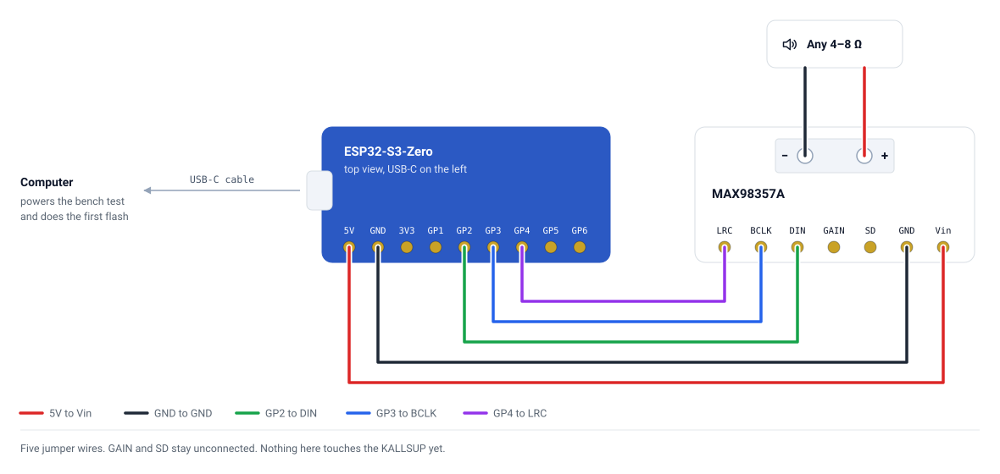
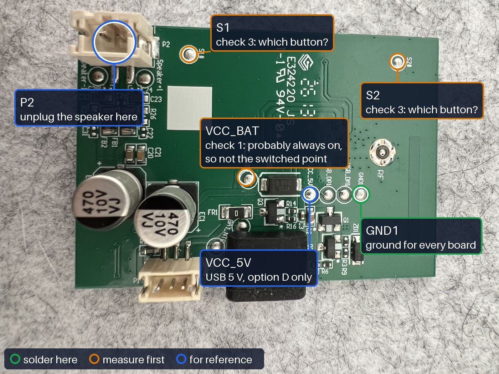
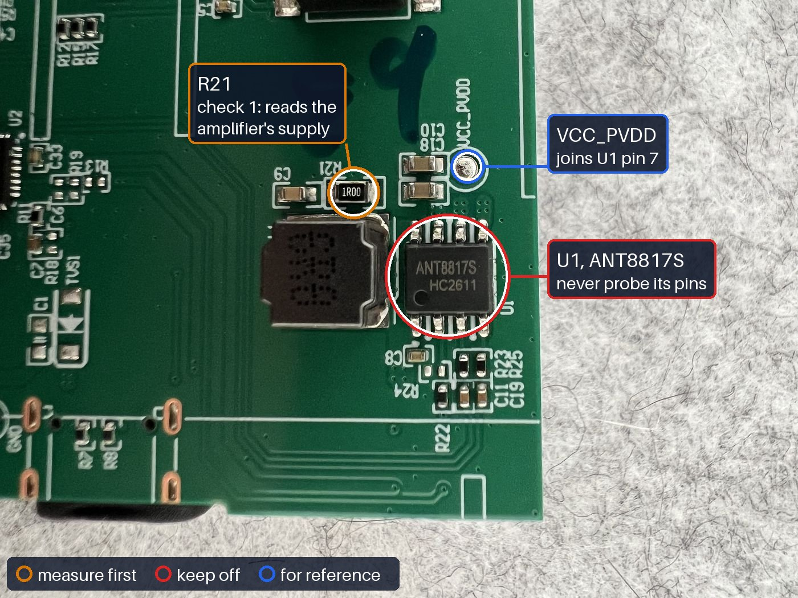
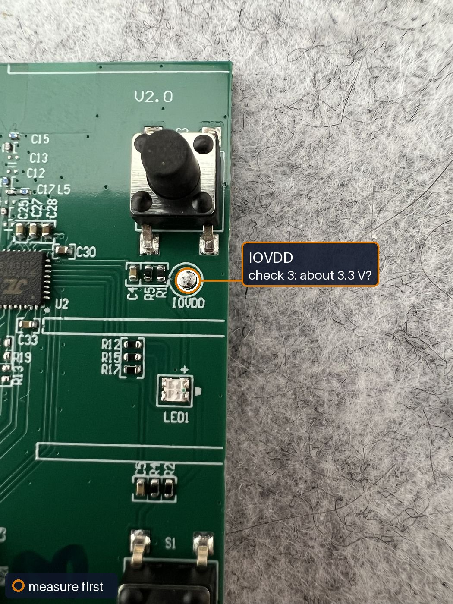
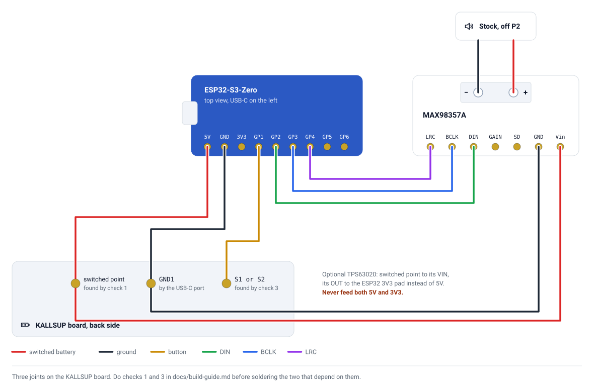

# 🧭 Build guide

Bench test, measure, then solder. Each stage catches a problem while it is still cheap to fix.

## 1. Bench test

Before the KALLSUP is opened, prove the new parts work on the desk.

1. Solder the header pins (or five wires) onto the MAX98357A, and its screw terminal.
2. Connect the ESP32 and the MAX98357A with jumper wires: `5V` to `Vin`, `GND` to `GND`, `GPIO2` to `DIN`, `GPIO3` to `BCLK`, `GPIO4` to `LRC`.
3. Connect any small 4–8 Ω speaker to the terminal.
4. Flash the firmware and adopt it in Home Assistant: [Firmware](firmware.md).
5. Play something from Music Assistant. The ESP32's LED turns green while it plays.

<picture>
  <source media="(prefers-color-scheme: dark)" srcset="assets/hookup-bench-dark.svg">
  
</picture>

The pins are drawn in the boards' real order, so the picture matches the parts on the desk.

Powered from the ESP32's USB-C on the bench, the whole thing is safe to rewire.

### If you use the TPS63020

Check the module on its own before it goes anywhere near the ESP32. Give its `VIN` and `GND` 3–5 V, from a charged cell or a bench supply, and measure `OUT` to `GND` with nothing else connected.

| Reading | Meaning | What to do |
|---|---|---|
| About 3.3 V | Ready | Connect it as in [Wiring](wiring.md#power) |
| 0 V | Not enabled | Link its `EN` pad to `VIN` |
| Any other voltage | Output set wrong | Check its output-select pads (such as 3V3, 4V2 and 5V) and set 3.3 V |

## Before you solder

Three checks on the KALLSUP board, all with the multimeter. Checks 1 and 3 take about fifteen minutes; check 2 needs the speaker left on for at least 30. They settle the three 🔍 items; nothing gets soldered until they are done.

For continuity: battery unplugged, USB unplugged, meter on the beep range. For voltage: meter on DC volts, black probe on `GND1`, and touch only test pads or the ends of passive parts, never the pins of a chip.

### Check 1: find the switched battery point 🔍

On battery only, no USB. Measure each candidate with the speaker **off**, then **on**:

| | |
|---|---|
|  |  |
| Back: `VCC_BAT`, and `GND1` for the black probe | Front: `R21`. Never put a probe on `U1` |

Rings on the photos: green, solder here; amber, measure first; red, keep off; blue, for reference.

| Point | Speaker off | Speaker on |
|---|---|---|
| `VCC_BAT` | | |
| Either end of `R21` (🔎 on the amplifier's boost switch node: at DC it reads the amplifier's supply) | | |
| The `+` end of EC1 and of EC2 (🔎 one is the amplifier's battery input; the other is `PVDD`, which beeps to `VCC_PVDD` unpowered: never use that one) | | |
| Other test pads or capacitor ends near the power circuit | | |

The point to use reads battery voltage (about 3.6–4.2 V) when on and about 0 V when off. `VCC_BAT` probably reads the cell in both states; do not use it, or the ESP32 drains the battery while the speaker looks off.

If nothing switches, the speaker's power button probably switches only the stock chips' logic. Open an issue with your readings before improvising.

### Check 2: does it switch itself off on battery? 🔍

On battery only, switch the speaker on, connect nothing over Bluetooth, and time how long it stays on. Leave it at least 30 minutes.

If it switches itself off, the switched rail goes with it and the ESP32 loses power mid-song. That is solvable, but it changes the design; open an issue with how long it lasted. Running from the stock USB-C (Option D in [Alternatives](alternatives.md)) avoids it entirely.

### Check 3: the second button's pad 🔍

`S1` and `S2` are on the back (the first photo in check 1); `IOVDD` is on the front, beside the button nearest the `V2.0` marking.

1. Unpowered, with continuity, find which of the back-side pads `S1` and `S2` connects to the second button (not the power button).
2. Powered and on, measure `IOVDD`, then that pad idle and with the button held.

| Reading | Meaning | What to do |
|---|---|---|
| `IOVDD` about 3.3 V; pad about 3.3 V idle, about 0 V pressed | Pulls to ground | Wire it to `GPIO1`; the firmware already expects this |
| Pad about 0 V idle, high when pressed | Pulls high | In the firmware set `mode: INPUT_PULLDOWN` and `inverted: false` |
| Several different voltages across buttons | A resistor ladder read by an ADC | Do not wire it; open an issue with the readings |
| `IOVDD` above 3.6 V | Higher logic than the ESP32 tolerates | Do not wire it directly |

## 2. Solder

<picture>
  <source media="(prefers-color-scheme: dark)" srcset="assets/hookup-kallsup-dark.svg">
  
</picture>

1. **Speaker**: unplug it from `P2` and connect it to the MAX98357A terminal, red to `+`, black to `−`. See [Wiring](wiring.md#speaker).
2. **Power**: from the switched point found in check 1, one wire to MAX98357A `Vin` and one to the ESP32 `5V` pad (or to the TPS63020 `VIN`, with its `OUT` to the ESP32 `3V3`, once its output is [checked](#if-you-use-the-tps63020)).
3. **Ground**: from `GND1` to every `GND`.
4. **Button**: from the pad found in check 3 to `GPIO1`.
5. **Audio**: `GPIO2`, `GPIO3`, `GPIO4` to `DIN`, `BCLK`, `LRC`, as on the bench.

Tin each pad and each wire first, then touch them together for a second. Tape or glue every wire down near its joint; a tugged wire lifts a pad.

## 3. First power-up

1. Switch on. The ESP32's LED lights red, then Home Assistant shows it online.
2. Play from Music Assistant, quietly first.
3. Press the second button once: playback pauses.
4. Switch off. The ESP32 should go dark with everything else.
5. Plug in USB-C and confirm it still charges.

### Battery runs

Before closing the case, play from a full charge until it cuts out, at a steady volume. One run answers two questions.

1. **Low battery.** If the ESP32 resets or drops Wi-Fi as the cell nears empty, add the TPS63020: [Hardware](hardware.md#tps63020-33-v-buck-boost-module-optional).
2. **Runtime.** Note how long it lasted and at what volume. An issue with the figure helps the next builder.

## 4. Assemble

- Insulate every bare joint and the backs of the small boards with Kapton tape or heat-shrink.
- Mount the boards with foam tape or a small printed carrier so they cannot rattle.
- Keep the ESP32's ceramic antenna away from the speaker magnet and the metal grille.
- Route wires away from the screw posts before closing the case.
