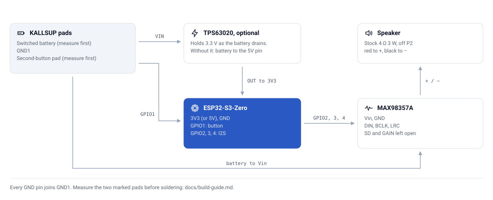
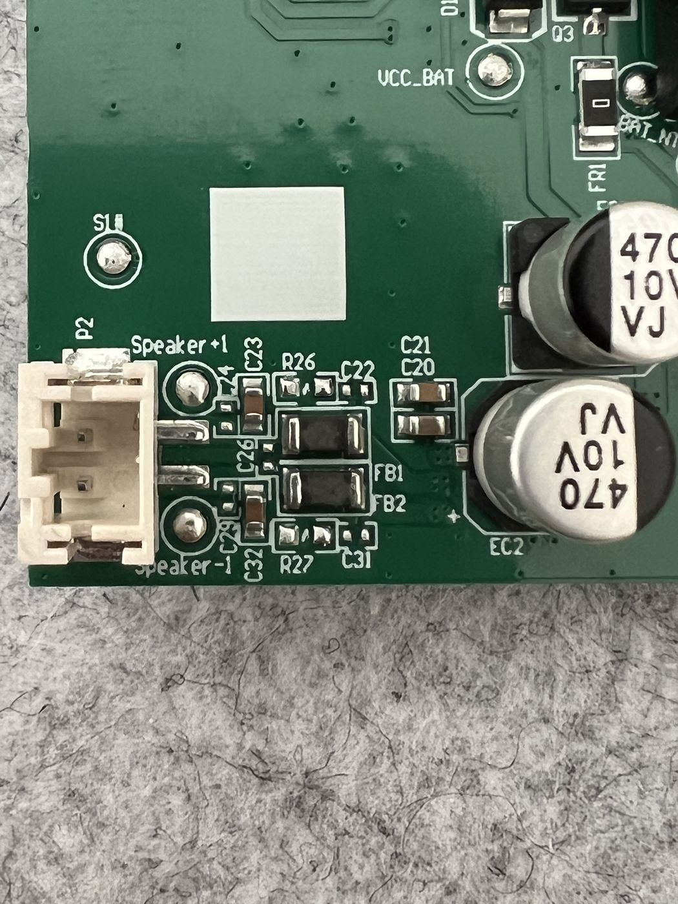
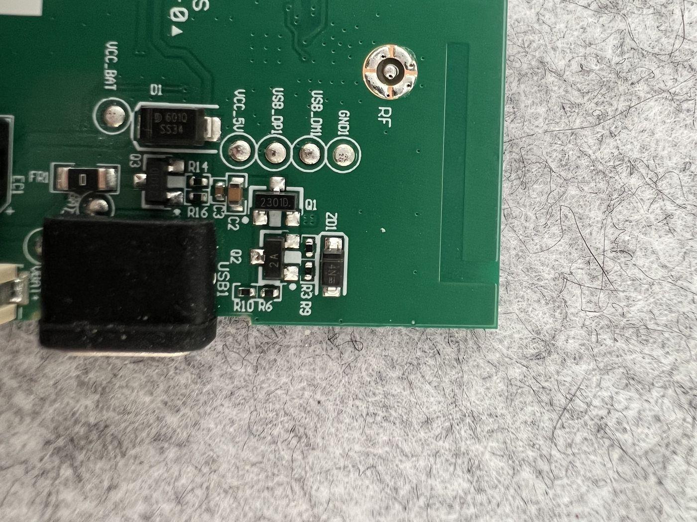
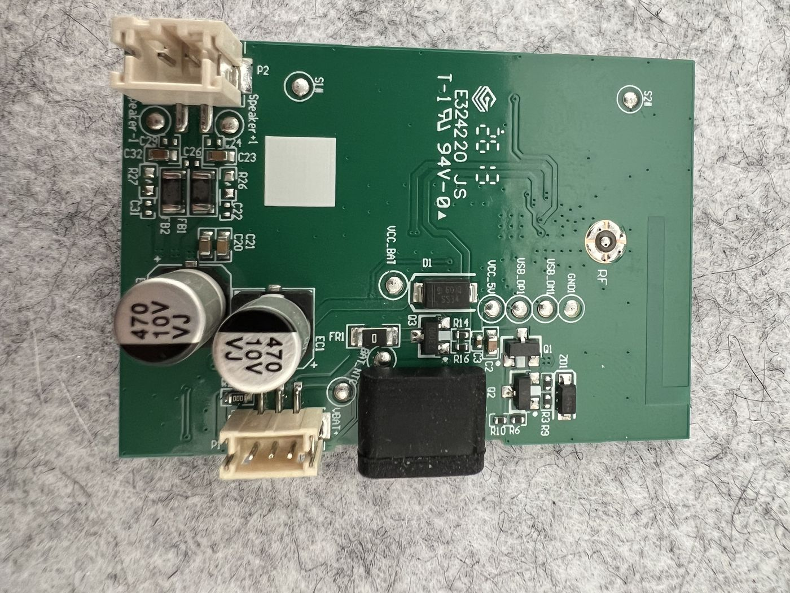

# 🔌 Wiring

<picture>
  <source media="(prefers-color-scheme: dark)" srcset="assets/wiring-dark.svg">
  
</picture>

Items marked 🔍 are not yet measured. Do the checks in [Build guide](build-guide.md#before-you-solder) before soldering them.

## Power

| From | To | Why |
|---|---|---|
| 🔍 Switched battery pad | MAX98357A `Vin` | The amplifier accepts 2.5–5.5 V, so the cell feeds it directly |
| 🔍 Switched battery pad | ESP32 `5V` | Simplest. Fine down to about 3.7 V of battery |
| 🔍 Switched battery pad → TPS63020 `VIN`, TPS63020 `OUT` | ESP32 `3V3` | Instead of the line above, if the ESP32 resets on a low battery |
| `GND1` | ESP32 `GND`, MAX98357A `GND`, TPS63020 `GND` | One ground point avoids hum |

**Switched, not raw.** `VCC_BAT` is the cell. If it is live even with the speaker off, which is likely, anything wired to it drains the battery while the speaker looks switched off. The point to use reads battery voltage with the speaker on and about 0 V with it off. Check 1 in the build guide finds it.

**Never feed both `5V` and `3V3`** on the ESP32. Use one or the other.

**Do not plug the ESP32's own USB-C in while it is powered from the battery**, unless you have confirmed the board isolates the two. Flash over USB on the bench; after installation, update over the air.

## Audio

| ESP32-S3-Zero | MAX98357A | Signal |
|---|---|---|
| `GPIO2` | `DIN` | I2S data |
| `GPIO3` | `BCLK` | I2S bit clock |
| `GPIO4` | `LRC` | I2S word select |
| — | `SD` | Left open |
| — | `GAIN` | Left open. To `GND` for 12 dB, or through 100 kΩ to `GND` for 15 dB |

The pins are the ones the SendspinZero Speaker firmware uses. Keep these three wires short.

## Speaker

Unplug the speaker from the stock `P2` connector and connect it to the MAX98357A's screw terminal: **red to `+`, black to `−`**.

The plug is small. Either snip the wires close to it and strip them into the terminal, or buy a matching 2-pin pigtail so nothing is cut. Measure the plug's pin spacing first: 1.25 mm is Molex PicoBlade or JST GH, 1.5 mm is JST ZH, 2.0 mm is JST-PH, 2.5 mm is JST-XH.

The stock output is treated as bridge-tied (🔎): `Speaker -` is not ground. With the speaker moved, `P2` is simply left empty.

## Button

| From | To | Why |
|---|---|---|
| 🔍 Second-button pad | ESP32 `GPIO1` | Play/pause, next, previous. See [Firmware](firmware.md#the-button) |

The two buttons each have a test pad on the back of the board, marked `S1` and `S2`. Find which pad belongs to the second button with continuity on an unpowered board, and measure how it behaves (check 3) before connecting it. The firmware assumes the pad sits near 3.3 V and drops to 0 V when pressed.

The power button is not wired to the ESP32.

## Where the pads are

`GND1`, `VCC_5V`, `USB_DP1` and `USB_DM1` are a row of four test pads near the USB-C port; `VCC_BAT` sits by diode `D1`. All are about 2 mm across and take a wire easily.

## Soldering budget

| Where | Joints | Size |
|---|---|---|
| KALLSUP board | 3: switched battery, `GND1`, button pad | `GND1` and button: large test pads; switched point: wherever check 1 finds it 🔍 |
| MAX98357A | 5 pins and the 2-pin terminal | 2.54 mm |
| TPS63020, if used | 4 pads | Large |
| ESP32-S3-Zero | None with pre-soldered headers | — |
